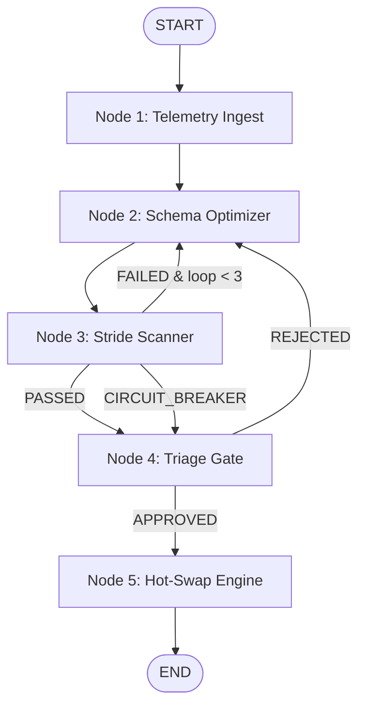

# SchemaAdapt-AI: Self-Healing Integration Gateway

A stateful, self-healing API gateway architecture layer built on **Google ADK 2.0 (Agent Development Kit)** and a local **IBM DataPower** developer instance. 

The gateway dynamically intercepts transaction execution faults caused by upstream data type drift (destructive changes) or undocumented payloads (additive variations), infers types via JavaScript reflection, generates schema adaptation patches using Gemini 2.5 Flash, runs compliance and syntax scanners, and hot-swaps the gateway adapter configurations live after a Human-in-the-Loop staging check.

---

## 1. System Topology & Architecture

The orchestration engine implements a state-graph loop running across 5 key nodes:



- **Node 1: Ingest & Telemetry Capture**: Monitors DataPower docker logs to intercept type collisions (e.g. `ERR_VAL_9988`) or additive field expansion faults.
- **Node 2: Adaptive Schema Optimizer**: Invokes Gemini 2.5 Flash with strict JSON schema specs to rebuild the processing code.
- **Node 3: Stride Verification Scanner**: Checks patch syntax using `node --check` and scans imports for security threat vectors (`child_process`, `fs`).
- **Node 4: Human-in-the-Loop Triage**: Visualizes the changes via a Git-style unified diff change manifest and pauses for engineering approval.
- **Node 5: Gateway Hot-Swap Engine**: Replaces the production script (`local/transform.js`) and validates connection stability via cURL (expecting `200 OK`).

---

## 2. Directory Structure

```text
SchemaAdapt-AI/
├── config/
│   └── auto-startup.cfg      # DataPower WebGUI and Loopback XML Firewall CLI config
├── local/
│   └── transform.js          # Production GatewayScript transforming adapter
├── patches/
│   ├── staging_patch.js      # Staging area for generated adaptation patches
│   └── change_manifest.md    # Generated Git-style diff manifest for triage
├── graph_engine.py           # Core orchestrator and state engine
├── mcp_server.py             # FastMCP host server exposing file/verification tools
├── pyproject.toml            # Workspace metadata and python dependencies
└── README.md                 # Project documentation
```

---

## 3. Deployment & Local Verification

### Prerequisites
- Python 3.11+ with `uv`
- Docker Desktop
- Node.js (for syntax validation check)

### Step 1: Spin up IBM DataPower Container
Ensure the developer container is deployed with correct port mappings (9090 for WebGUI, 8000 for the gateway) and volume mappings:
```bash
docker run -d --name datapower-gateway \
  -e DATAPOWER_ACCEPT_LICENSE=true \
  -p 9090:9090 -p 8000:8000 \
  -v ${PWD}/local:/opt/ibm/datapower/drouter/local \
  -v ${PWD}/config:/opt/ibm/datapower/drouter/config \
  icr.io/cpopen/datapower/datapower-limited:10.6.0.0
```

### Step 2: Initialize Workspace & Run Orchestrator
Install dependencies and launch the state graph engine:
```bash
uv sync
uv run python graph_engine.py
```

### Step 3: Trigger a Schema Drift Fault
To test the pipeline, fire an invalid payload to the gateway (e.g. sending `id` as a string instead of a number):
```bash
curl.exe -v -H "Content-Type: application/json" -d "{\"id\": \"ERR_VAL_9988\", \"name\": \"Alice\"}" http://localhost:8000/
```
The gateway will return a `400 Bad Request`. The orchestrator will immediately detect the log event, optimize the code, output a visual diff, and wait for your input (`APPROVE` / `REJECT`) to hot-swap and heal the gateway.
