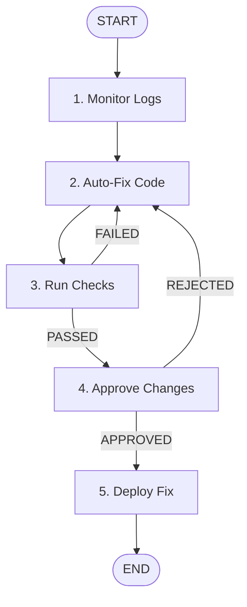

# SchemaAdapt-AI: Auto-Healing API Gateway

An intelligent API gateway built using **Google ADK 2.0** and a local **IBM DataPower** service. 

This gateway automatically fixes issues when incoming data does not match the expected structure. For example, if an external system starts sending text instead of numbers, or adds new unexpected fields, this system will automatically analyze the changes, rewrite the rules, run checks, and update itself after your approval.

---

## 1. How It Works

The system operates in a continuous loop through 5 simple steps:



1. **Monitor Logs**: The system watches the API gateway logs. If a request crashes due to mismatched data types or unexpected new fields, it captures the error and the problematic data.
2. **Auto-Fix Code**: It asks Gemini to analyze the error and update the JavaScript processing script to support the new format without losing old data.
3. **Run Checks**: It scans the updated code to ensure it has no syntax errors and complies with security standards (blocking unsafe modules).
4. **Approve Changes (Triage)**: It shows you a visual comparison (Git diff) of what will change and pauses for your approval.
5. **Deploy Fix**: Once approved, it copies the new script to the running gateway and fires a test request to confirm everything is fixed.

---

## 2. Project Folder Structure

```text
SchemaAdapt-AI/
├── config/
│   └── auto-startup.cfg      # Gateway and portal configuration commands
├── local/
│   └── transform.js          # The active JavaScript processing rules
├── patches/
│   ├── staging_patch.js      # Staging area for new updates
│   └── change_manifest.md    # Code changes comparison sheet
├── graph_engine.py           # Core orchestrator running the loop
├── mcp_server.py             # File scanner and testing tools
├── pyproject.toml            # Python package manager
└── README.md                 # Project guide
```

---

## 3. Local Setup & Testing

### Prerequisites
- Python 3.11+
- Docker Desktop
- Node.js (for checking code syntax)

### Step 1: Start the API Gateway
Run the DataPower gateway container with ports mapped:
```bash
docker run -d --name datapower-gateway \
  -e DATAPOWER_ACCEPT_LICENSE=true \
  -p 9090:9090 -p 8000:8000 \
  -v ${PWD}/local:/opt/ibm/datapower/drouter/local \
  -v ${PWD}/config:/opt/ibm/datapower/drouter/config \
  icr.io/cpopen/datapower/datapower-limited:10.6.0.0
```

### Step 2: Start the Orchestrator
Install packages and start the monitoring script:
```bash
uv sync
uv run python graph_engine.py
```

### Step 3: Trigger a Failure
Send a mismatched payload (sending text `"ERR_VAL_9988"` where a number is expected):
```bash
curl.exe -v -H "Content-Type: application/json" -d "{\"id\": \"ERR_VAL_9988\", \"name\": \"Alice\"}" http://localhost:8000/
```
The gateway will reject it with a `400 Bad Request`. The orchestrator will automatically intercept this error, generate the fix, show you the proposed changes, and wait for you to type **APPROVE** to apply the fix live.
